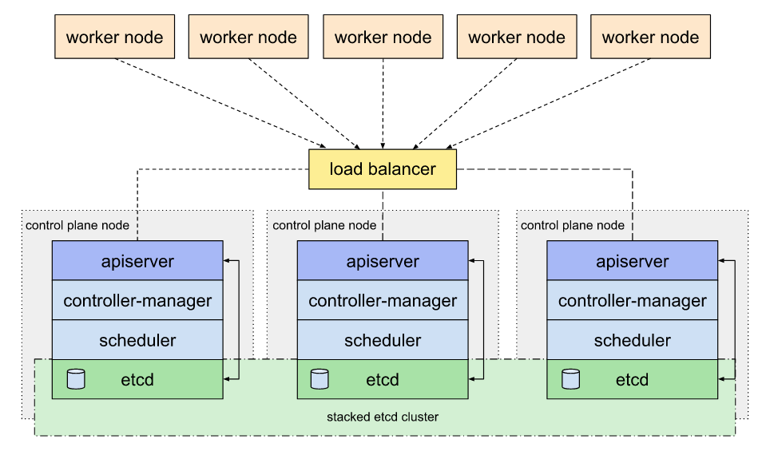
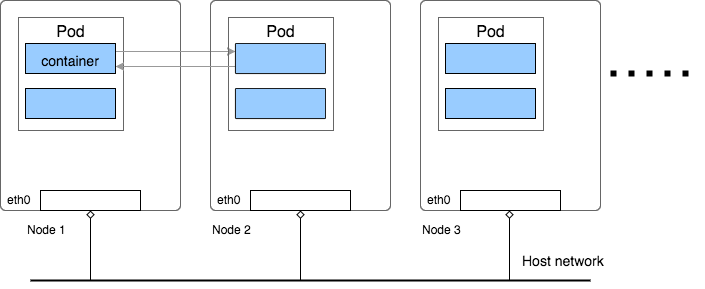
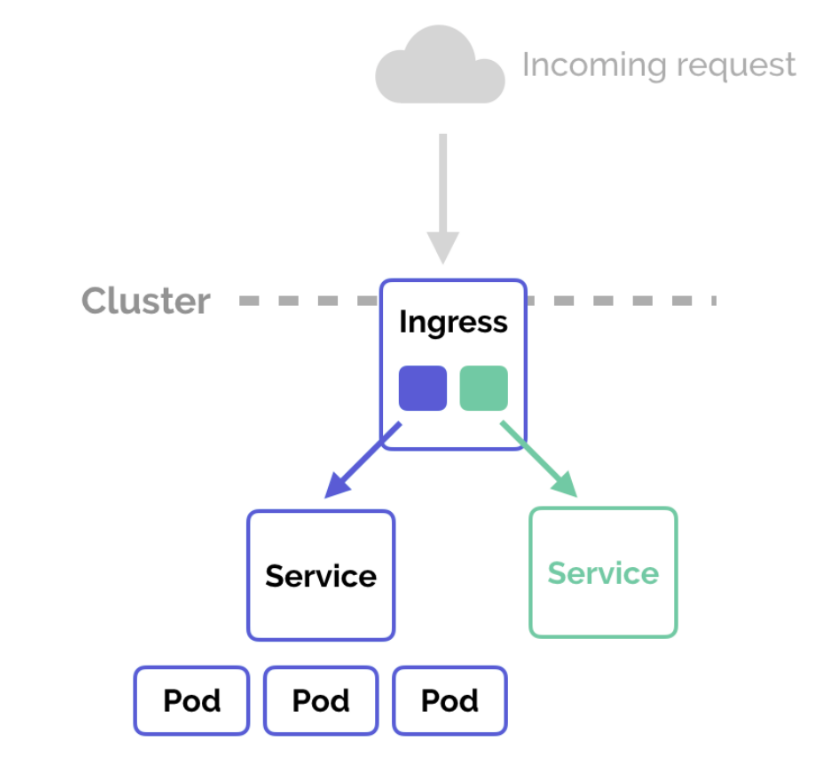

# One repository to rule them all...
Ansible playbooks and roles to configure a highly available stacked etcd kubernetes cluster on-premises(simple cloud vms) using kubeadm.   



# Network
There is a private network that all of the nodes will be in, and network access will be provided through gateway node.


<sub>[_edit diagram_](https://docs.google.com/drawings/d/1nuIsNcscrDHL8KtFhlKiYnsQjlfL5JTpK3qbIu3Raz4/edit?usp=sharing)</sub>

# Configure ansible
Guidance to install ansible and use it to deploy playbooks on all the hosts.  

- Apply following steps to install correct version of ansible on controller node:

```
sudo apt update
sudo apt install python3-pip python3-dev
python3 -m pip install -U pip
python3 -m pip install --user ansible==5.6.0
<!-- Log out and log in if ansible is not recognized -->
ansible-galaxy install -r roles/requirements.yml
```

- Generate ssh key for ubuntu user on gateway:

```
ssh-keygen
```

- Copy public key to main repository deploy keys to have access to the project.

- Pull main project from github and run ansible plays incrementally on controller.  

# Deploying
Apply the following steps to deploy the cluster.  

1. Configure packet forwarding on gateway node.
2. Configure load balancing between api-servers.
3. Init kubernetes cluster on genesis master node.
4. Join other master nodes to the cluster.
5. Join workers to the cluster.
6. Deploy Nginx Ingress.
7. Deploy kubernetes dashboard.
8. Deploy monitoring stack.

# Kubernetes
Deploying ha kubernetes needs a lot of configurations, most important of which is the kubernetes network plugin you are using. we are using flannel, flannel uses a special pod ci/dr network of 10.244.1.1/16, and if set otherwise will not work.  



# Nginx Ingress
Using Ingress resources to expose services on the cluster needs deploying an ingress controller first. Nginx controller will handle proxying requests to the right services. 



Ingress controller itself is a service and therefore needs to be expose its 80 and 443 ports to the internet, there are to options here:
* Use a load balancer service to expose the ingress controller.
* Expose on node ports.

When you create a load balancer service in a freshly started kubernetes on-premises cluster, you will notice the LB IP address is pending, MetalLB will assign the IP address to the service after the request.  
